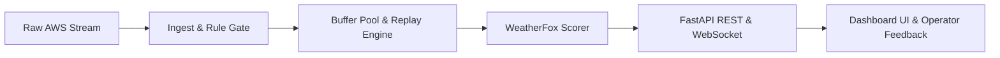

# WeatherFox — Automated AWS Quality Control & Anomaly Detection (SIH26073)

WeatherFox is an automated quality control system for Automatic Weather Station (AWS) surface weather telemetry (SIH26073).
It combines rule-based ingest checks, comparison with each station's own history and its neighbours, and (in the trained model) conformal p-values, to separate sensor faults from genuine regional weather. The code package is still named `skyguard`.



---

## 🚀 Quick Start & One-Command Demo

### Installation
```bash
git clone https://github.com/muthukkumaranb/WeatherFox.git
cd WeatherFox
pip install -r requirements.txt
```

### Run One-Command Demo
```bash
python -m skyguard.demo
```
This command starts the FastAPI server, background replay engine (at 1800x simulated speed), and automatically launches the interactive dashboard UI at `http://127.0.0.1:8000`.

### Run Test Suite
```bash
python -m pytest -q
```

---

## 📡 API Endpoints List

| Method | Endpoint | Description |
|---|---|---|
| `GET` | `/health` | System health check and version info |
| `GET` | `/scorer-info` | Active scorer backend (`fake` vs `real`) and model status banner |
| `POST` | `/score` | Standalone scoring endpoint for target station window |
| `GET` | `/stations` | List registered AWS stations with latest telemetry and status |
| `GET` | `/stations/{id}/series` | 48-hour time series telemetry for a specific station |
| `GET` | `/alerts` | Inbox of anomaly and uncertain alerts (supports `?state=` filter) |
| `POST` | `/alerts/{id}/ack` | Operator feedback endpoint (Acknowledge, Resolve, Reject) |
| `GET` | `/export` | WMO-compliant QC CSV export with raw values & flag columns |
| `GET` | `/health/sensors` | Maintenance health telemetry and trend predictions |
| `POST` | `/inject-fault` | Inject simulated fault presets (55 °C out_of_range, Mungeshpur radiation) |
| `POST` | `/inject-event` | Inject genuine weather events (heat_wave, squall, cyclone) |
| `POST` | `/replay/speed` | Adjust replay simulation speed factor |
| `GET` | `/benchmark` | Benchmark evaluation reports and comparative metrics |
| `WS` | `/ws/live` | Live WebSocket stream for real-time verdict streaming |

---

## 📁 Repository Layout & Ownership

| Directory / File | Description | Ownership |
|---|---|---|
| `skyguard/data/` | Data loading, registry, and dataset split logic | Person A |
| `skyguard/detect/` | Feature extraction and ML forecaster models | Person A |
| `skyguard/verdict/` | Conformal classifier and verdict scoring pipeline | Person A |
| `skyguard/validate/` | Validation and calibration verification routines | Person A |
| `skyguard/schemas/` | JsonSchema definitions (`input_row`, `verdict`, `injection_label`) | Person A |
| `skyguard/api/` | FastAPI application, WebSocket server, and endpoints | Person B |
| `skyguard/ingest/` | Ingest rule gate, window buffers, and replay engine | Person B |
| `skyguard/eval/` | Evaluation harness, leak detection, and baselines | Person B |
| `skyguard/edge/` | C port, ESP32 sketch, edge measurement scripts | Person C |
| `skyguard/fake_score.py` | Stand-in demo scorer for offline execution | Person B |
| `skyguard/scorer.py` | Universal scoring dispatch layer (`SKYGUARD_SCORER=fake|real`) | Person B |
| `dashboard/` | Glassmorphic web dashboard UI with Leaflet live map | Person B |
| `config/` | System configuration (`config/skyguard.toml`) | Person B |
| `tests/` | Pytest test suite covering contract, API, eval, and demo | Person B |
| `scripts/` | End-to-end verification scripts and demo utilities | Person B |
| `docs/` | Use cases, judge Q&A, reproducibility guide | Person C |

---

## 📊 Datasets & Methodological Boundaries

- **Data Sources**: NOAA GHCNh hourly synoptic and airport observations for Indian stations (training and testing); IMD WIS 2.0 live SYNOP feed (about 320 stations, every 3 hours) for live mode.
- **IMD AWS Limits**: The system is evaluated on GHCNh synoptic stations across India, not proprietary IMD AWS hardware streams.
- **METAR Rounding**: Airport METAR observations undergo degree rounding (1 °C resolution), accounted for via tolerance bounds (`metar_rounding_tolerance_C = 1.0`).
- **Injected Fault Ground Truth**: Evaluation of sensor fault detection relies on controlled synthetic fault injections (spikes, frozen readings, drift, out-of-range, radiation shield heating) following physical fault distribution models.
- **Validation (planned)**: agreement with Met Office HadISD quality flags on Indian stations, reported as agreement, not accuracy. Not run yet.

---

## 📈 Committed System Benchmark Performance

### Scale Test Performance (`reports/scale/results.json`)
Rule-based stand-in scorer, one Windows laptop core, 5,000 readings × 3 runs per size.

- **100 Stations**: Mean throughput **74.82 readings/sec**, Latency p50 **12.93 ms**, p95 **20.13 ms**, Peak RAM **0.25 MB**
- **1,000 Stations**: Mean throughput **102.08 readings/sec**, Latency p50 **9.48 ms**, p95 **13.14 ms**, Peak RAM **0.34 MB**
- **10,000 Stations**: Mean throughput **117.60 readings/sec**, Latency p50 **7.89 ms**, p95 **12.04 ms**, Peak RAM **1.08 MB**

### Edge Microcontroller Deployment (`reports/edge/edge.json`)
- **C Rule Gate Binary Size (`rule_gate.o`)**: 4,288 Bytes (4.3 KB)
- **Tiny Tree Binary Size (`tiny_tree.o`)**: 2,664 Bytes (2.7 KB)
- **Host Execution Speed**: 2.043 µs per reading on a laptop CPU (gcc 13.3.0; not measured on ESP32)
- **C vs Python Parity**: 10,000 / 10,000 (100% agreement)
- **Edge tree (held-out, synthetic faults)**: catches 74 % of faults at 84 % precision (accuracy 94.55 % is misleading: 88.5 % of rows are normal)

### Model Evaluation Results
- **Status**: **pending final evaluation** (full ML detector pipeline evaluation pending final test completion).
