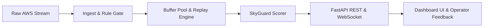

# SkyGuard AI — Automated AWS Quality Control & Anomaly Detection System

SkyGuard AI is an automated quality control system for Automatic Weather Station (AWS) surface weather telemetry (SIH26073).
It combines rule-based ingest filtering, spatial-temporal window scoring, and conformal prediction to distinguish sensor faults from genuine regional weather events.



---

## 🚀 Quick Start & One-Command Demo

### Installation
```bash
git clone https://github.com/muthukkumaranb/WeatherFox.git
cd WeatherFox
pip install -r requirements.txt
```

### Run One-Command Demo
```bash
python -m skyguard.demo
```
This command starts the FastAPI server, background replay engine (at 1800x simulated speed), and automatically launches the interactive dashboard UI at `http://127.0.0.1:8000`.

### Run Test Suite
```bash
python -m pytest -q
```

---

## 📡 API Endpoints List

| Method | Endpoint | Description |
|---|---|---|
| `GET` | `/health` | System health check and version info |
| `GET` | `/scorer-info` | Active scorer backend (`fake` vs `real`) and model status banner |
| `POST` | `/score` | Standalone scoring endpoint for target station window |
| `GET` | `/stations` | List registered AWS stations with latest telemetry and status |
| `GET` | `/stations/{id}/series` | 48-hour time series telemetry for a specific station |
| `GET` | `/alerts` | Inbox of anomaly and uncertain alerts (supports `?state=` filter) |
| `POST` | `/alerts/{id}/ack` | Operator feedback endpoint (Acknowledge, Resolve, Reject) |
| `GET` | `/export` | WMO-compliant QC CSV export with raw values & flag columns |
| `GET` | `/health/sensors` | Maintenance health telemetry and trend predictions |
| `POST` | `/inject-fault` | Inject simulated fault presets (55 °C out_of_range, Mungeshpur radiation) |
| `POST` | `/inject-event` | Inject genuine weather events (heat_wave, squall, cyclone) |
| `POST` | `/replay/speed` | Adjust replay simulation speed factor |
| `GET` | `/benchmark` | Benchmark evaluation reports and comparative metrics |
| `WS` | `/ws/live` | Live WebSocket stream for real-time verdict streaming |

---

## 📁 Repository Layout & Ownership

| Directory / File | Description | Ownership |
|---|---|---|
| `skyguard/data/` | Data loading, registry, and dataset split logic | Person A |
| `skyguard/detect/` | Feature extraction and ML forecaster models | Person A |
| `skyguard/verdict/` | Conformal classifier and verdict scoring pipeline | Person A |
| `skyguard/validate/` | Validation and calibration verification routines | Person A |
| `skyguard/schemas/` | JsonSchema definitions (`input_row`, `verdict`, `injection_label`) | Person A |
| `skyguard/api/` | FastAPI application, WebSocket server, and endpoints | Person B |
| `skyguard/ingest/` | Ingest rule gate, window buffers, and replay engine | Person B |
| `skyguard/eval/` | Evaluation harness, leak detection, and baselines | Person B |
| `skyguard/edge/` | C/C++ port and ESP32 edge deployment files | Person B |
| `skyguard/fake_score.py` | Stand-in demo scorer for offline execution | Person B |
| `skyguard/scorer.py` | Universal scoring dispatch layer (`SKYGUARD_SCORER=fake|real`) | Person B |
| `dashboard/` | Glassmorphic web dashboard UI with Leaflet live map | Person B |
| `config/` | System configuration (`config/skyguard.toml`) | Person B |
| `tests/` | Pytest test suite covering contract, API, eval, and demo | Person B |
| `scripts/` | End-to-end verification scripts and demo utilities | Person B |
| `docs/` | System documentation and handover specification | Person B |

---

## 📊 Datasets & Methodological Boundaries

Per handover documentation (§10):
- **Data Source**: Uses GHCNh (Global Historical Climatology Network hourly) synoptic and airport observations, supplemented by ASOS 1-minute validation datasets.
- **IMD AWS Limits**: The system is evaluated on GHCNh synoptic stations across India, not proprietary IMD AWS hardware streams.
- **METAR Rounding**: Airport METAR observations undergo degree rounding (1 °C resolution), accounted for via tolerance bounds (`metar_rounding_tolerance_C = 1.0`).
- **Injected Fault Ground Truth**: Evaluation of sensor fault detection relies on controlled synthetic fault injections (spikes, frozen readings, drift, out-of-range, radiation shield heating) following physical fault distribution models.
- **Validation Datasets**: ASOS 1-minute data and HadISD quality control flags are used strictly for independent validation and baseline benchmarking.

---

## 📈 Evaluation Results

*Results pending final test.*

(This section is populated exclusively from `reports/final/metrics.md` upon completion of final benchmark evaluation runs.)
